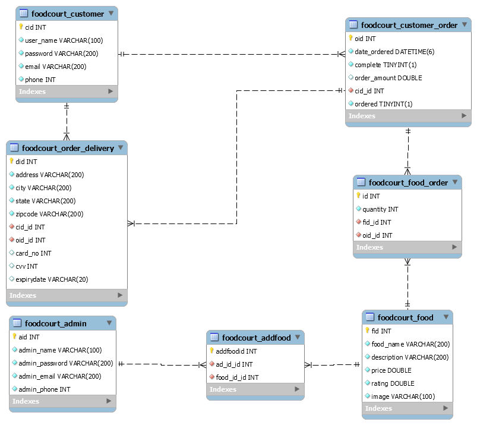

# eFoodCourt
<h3>A web app to take orders from customers for a restaurant. Customer can add food in cart, can order food,
can see their all previous orders and the orders that are not delivered yet.</h3>
<h3>Restaurant admin can add food, can see previous orders made by all customers and the
orders that are not delivered yet.</h3>
<h2>ER Diagram :-</h2>
</img>

<h2>Schema Diagram :-</h2>
</img>

<h1>Interface :-</h1>
</img>
</img>
</img>
</img>
</img>
</img>
</img>
</img>
</img>
</img>
</img>
</img>

<h2>For more details you can see :- https://github.com/Jatin-Goyal-552/eFoodCourt/blob/main/Final%20Submission%20of%20CS262%20Project.pdf</h2>
